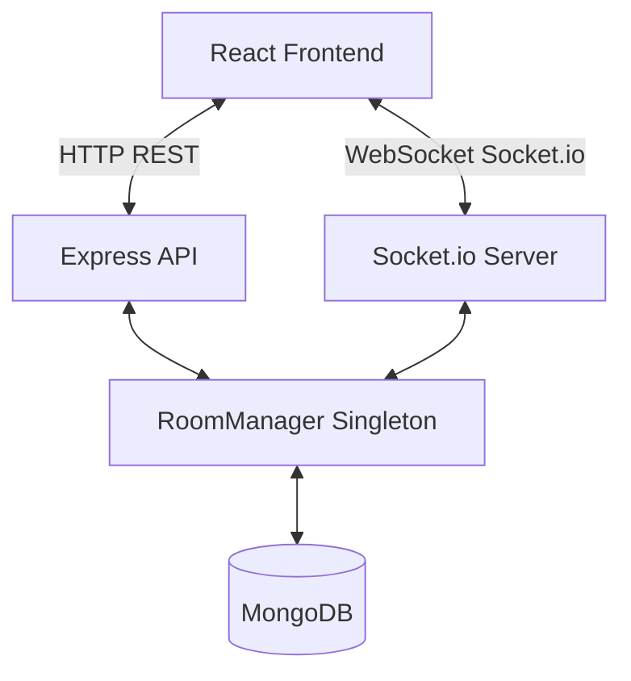

# Tambola System Architecture

This document provides a high-level overview of the architectural design and data flow of the Tambola application.

## High-Level Architecture

The system follows a classic client-server model with a real-time, event-driven communication layer.

### 1. Frontend Architecture (Clean Architecture)
The React frontend (located in `website/src`) is structured using a Domain-Driven Design (Clean Architecture) approach:

*   **Domain Layer (`domain/`)**: Contains pure TypeScript entities (`Game`, `Player`, `Ticket`) that represent the core business models.
*   **Application Layer (`application/`)**: Houses Use Cases (e.g., `GenerateTicketUseCase`, `CallNextNumberUseCase`, `ClaimGameUseCase`) encapsulating the specific business rules without UI dependencies.
*   **Infrastructure Layer (`infrastructure/`)**: Contains Singletons and services that interact with external systems:
    *   `GameManager.ts`: A Singleton that maintains the client-side game state, applies Use Cases, and notifies React components via the Observer pattern.
    *   `SocketService.ts`: Manages the WebSocket connection to the server.
    *   `SoundService.ts`: Manages audio playback for numbers and events.
*   **Presentation Layer (`presentation/`, `pages/`)**: Contains React components, hooks (e.g., `useGameState`), and UI views. The UI strictly observes the `GameManager` state.

### 2. Backend Architecture
The Node.js backend (located in `backend/src`) is built with Express and Socket.io:

*   **REST API Layer**: Express routes (`/api/rooms`) handle initial room creation, settings configuration, and joining validation.
*   **WebSocket Layer**: Socket.io handles real-time bidirectional communication. It manages events like `join_room`, `start_game`, `call_number`, `mark_number`, and `claim_result`.
*   **Service Layer**: `RoomManager` is a Singleton that manages the server-side state for all active rooms. It handles state transitions, validates calls, and tracks player presence.
*   **Persistence Layer**: MongoDB is used to persist active rooms and game states, ensuring that rooms can be recovered or audited.

## Data Flow & Synchronization

The game relies heavily on real-time state synchronization to ensure all players and the host see the exact same game state.

1.  **Room Creation**: The Host creates a room via a REST API call. The backend generates a room code and stores the initial settings.
2.  **Joining & Hydration**: When a Guest joins, they connect via WebSocket (`join_room`). The server sends a `room_state_sync` event, allowing the client's `GameManager` to perfectly hydrate its state (called numbers, players, tickets).
3.  **Real-time Play**: 
    *   The Host (or Auto-Caller) triggers a `call_number` event.
    *   The server updates the `RoomManager` and broadcasts `number_called` to all clients.
    *   Clients update their local `GameManager` and play the corresponding sound.
4.  **Claiming**: 
    *   A player makes a claim (e.g., `housefull`).
    *   The client validates the claim locally and emits `claim` and `claim_result` to the server.
    *   The server broadcasts `claim_result_broadcast`, and all clients update their leaderboards and game status.
5.  **Disconnection Handling**: The server tracks socket disconnects and updates the `RoomManager` to mark players as "left", broadcasting `player_left` to keep the UI in sync without disrupting the ongoing game.
